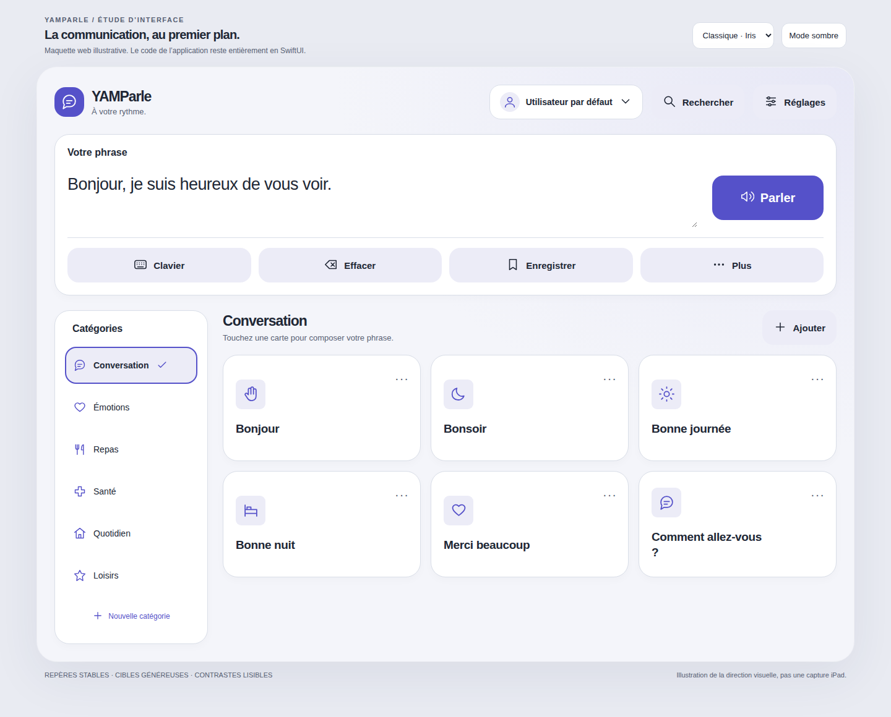
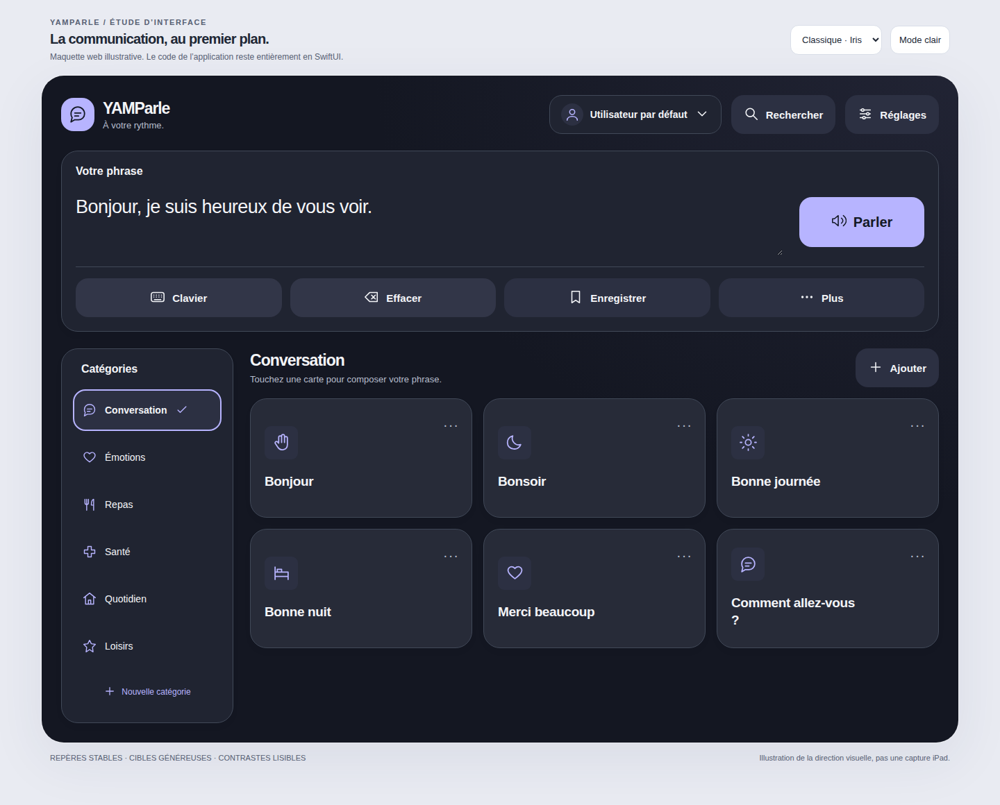

# YAMParle · Refonte iPad

## Direction proposée

**La communication au premier plan.** Une interface calme, adulte et lumineuse, avec un accent iris, des surfaces opaques légèrement teintées, des cartes généreuses et un seul bouton dominant : **Parler**. Le caractère futuriste vient des volumes, du dessin des icônes et des nuances, pas d’effets lumineux derrière le texte.

Le thème change l’ambiance, jamais la place des actions. Cette stabilité protège la mémoire motrice. Aucun tri automatique des phrases selon la fréquence, aucune animation de réorganisation, aucun décor animé.



> Les illustrations et [l’aperçu interactif](apercu-interface.html) sont des maquettes web de référence, pas des captures du code SwiftUI exécuté. Elles permettent de comparer les sept univers et les modes clair/sombre. Seules la sélection du thème, l’apparence, la composition et l’annulation sont interactives dans cette maquette. Les pictogrammes web sont illustratifs ; l’application utilise SF Symbols.

## 1. Hiérarchie de l’écran principal

```text
YAMParle · À votre rythme         Profil actif   Rechercher   Réglages
┌──────────────────────────────────────────────────────────────────┐
│ Votre phrase                                                     │
│ Texte libre / clavier iOS natif                       [ PARLER ]  │
│                                                                  │
│ [ Clavier ]  [ Effacer / Rétablir ]  [ Enregistrer ]  [ Plus ]    │
└──────────────────────────────────────────────────────────────────┘
┌───────────────────┐  Conversation                      [ Ajouter ]
│ Catégories        │  Touchez une carte pour composer votre phrase.
│ ✓ Conversation    │  ┌────────────┐ ┌────────────┐ ┌────────────┐
│   Émotions        │  │ Icône   ⋯  │ │ Icône   ⋯  │ │ Icône   ⋯  │
│   Repas           │  │ Bonjour    │ │ Bonsoir    │ │ Merci      │
│   …               │  └────────────┘ └────────────┘ └────────────┘
│ Nouvelle catégorie│  Autres phrases…
└───────────────────┘
```

1. **Message et Parler** : premier niveau, toujours associés visuellement.
2. **Composition** : clavier, effacement réversible, enregistrement.
3. **Choix des phrases** : catégories puis grille, lecture de gauche à droite.
4. **Gestion** : Ajouter, options de carte et Réglages, moins dominants.
5. **Personnalisation** : profil et thème, en dehors du trajet habituel pour parler.

Les fonctions secondaires ne sont pas supprimées : dernier mot et plein écran sont dans **Plus** ; nouvelle phrase et nouvelle catégorie dans **Ajouter**. L’enregistrement de la phrase courante reste directement accessible.

### Adaptation à la fenêtre

- À partir de **960 pt** de largeur, hors tailles de texte d’accessibilité : panneau des catégories de **248 pt**, grille adaptative à droite, défilements séparés des catégories et des phrases.
- En fenêtre étroite, portrait ou Split View : page verticale défilante, catégories horizontales. Une largeur régulière ne signifie pas « paysage ».
- Sous **700 pt**, le bouton Parler passe sous le texte. En Dynamic Type d’accessibilité, la grille passe à une colonne et les catégories se choisissent dans une liste dépliable.
- L’ouverture du clavier ne change pas la branche de disposition selon la hauteur. En disposition large, l’en-tête de navigation s’efface pendant la saisie pour libérer de la place, sans remplacer le compositeur. La barre native du clavier garde Parler/Arrêter et Masquer le clavier.
- Sur fenêtre compacte, la page entière peut défiler : la barre du clavier conserve l’action Parler pendant la saisie. Il reste à vérifier les très petites hauteurs avec Stage Manager.

## 2. Écran par écran

### A. Communiquer · implémenté

**En-tête.** Identité discrète, profil avec avatar, recherche et réglages explicitement libellés. Pas de rangée de petites icônes ambiguës de 36 pt.

**Compositeur.** `TextEditor` natif, texte lisible, curseur iOS, sélection/correction/collage système. L’espace réservé « Que souhaitez-vous dire ? » ne reçoit pas les interactions et n’est pas lu une deuxième fois par VoiceOver.

**Parler.** Accent plein, hauteur minimale 72 pt. Désactivé pour un message vide. Devient **Arrêter** pendant la lecture, y compris pendant une génération ElevenLabs en attente. Il ne change pas d’emplacement.

**Effacer.** Effacement immédiat, sans confirmation gênant la communication ; le même bouton devient **Rétablir**. Une nouvelle composition invalide ce rétablissement. Ce n’est pas un historique multi-niveaux.

**Carte.** Symbole ou photo, texte en `.title3`, options visibles `⋯`. Pas de réduction automatique de la taille du texte. Une phrase longue agrandit sa carte. Le toucher ajoute `item.text`, jamais l’étiquette abrégée. Si « parler au toucher » est activé, il lit aussi l’élément via son moteur/audio propre.

**Actions de carte.** Lire sans ajouter et modifier, dans un menu explicite et en actions VoiceOver. Pas de geste long obligatoire pour découvrir la modification.

**États vides.** Une catégorie vide propose Ajouter une phrase ; un profil sans catégorie propose Créer une catégorie. Aucune substitution silencieuse par les phrases d’un autre profil.

### B. Rechercher · implémenté

Feuille native avec recherche système, mêmes cartes que l’accueil, filtrage du texte, de l’étiquette et du texte prononcé. Recherche insensible à la casse et aux accents. Une carte ajoute le texte puis ferme la recherche ; la lecture seule passe par son menu. La modification attend la fermeture de la recherche avant d’ouvrir l’éditeur, pour éviter deux feuilles concurrentes.

État sans résultat avec la requête, bouton Fermer toujours disponible. La recherche ne change ni l’ordre enregistré ni la catégorie choisie à l’accueil.

### C. Nouvelle phrase / Modifier · écran existant conservé

Les formulaires `ItemEditorView` restent utilisés : aperçu, texte, étiquette facultative, catégorie, symbole/photo, texte prononcé, Apple/ElevenLabs/enregistrement personnel. L’enregistrement depuis le compositeur préremplit le texte et la catégorie active.

**Proposition pour une seconde passe visuelle :** aperçu fondé sur la même carte, puis trois sections « Contenu », « Apparence », « Voix ». Déplacer le texte prononcé alternatif et le moteur individuel dans une section avancée repliable. Conserver Annuler/Enregistrer dans la barre native. Cette restructuration du formulaire n’est pas présentée comme implémentée dans cette livraison.

### D. Catégories · implémenté

Accès depuis Réglages → Communication. Liste des catégories du seul profil actif. Création et modification du nom, du symbole et de la couleur. Un aperçu présente les choix ; chaque symbole et couleur a un libellé d’accessibilité.

Renommer garde l’identifiant et les phrases rattachées. Les erreurs de sauvegarde restent visibles dans la feuille. La suppression et le réordonnancement ne sont pas ajoutés ici : ils demandent une confirmation adaptée et une stratégie explicite pour les phrases rattachées.

### E. Réglages · implémenté

Cinq groupes, sans fausse fonction de sauvegarde :

1. **Votre espace** : profil actif, statut par défaut, gestion des utilisateurs.
2. **Apparence** : thème et choix Système/Clair/Sombre.
3. **Communication** : parole et son, catégories.
4. **Confort d’utilisation** : contraste renforcé, retour haptique si disponible, taille des cartes.
5. **À propos et données** : version réellement fournie par le bundle et stockage local.

Les réglages de confort concernent l’appareil ; le thème concerne le profil. Le faux bouton « Sauvegarder ce profil » de l’ancien écran, qui n’effectuait pas d’export, n’est pas repris. Le bouton de restauration qui réappelait simplement l’initialiseur n’est pas repris non plus. Aucun nouveau service d’export n’est annoncé.

### F. Thèmes et apparence · implémenté

Galerie de sept cartes avec miniature de la disposition, nom, description et indicateur de sélection. Une pression applique le thème au profil actif. La sélection repose sur une coche et un libellé, pas seulement sur la couleur.

Système suit le réglage iPadOS ; Clair et Sombre le forcent. L’apparence est globale à l’appareil, indépendante de l’identifiant de thème sauvegardé dans chaque profil. En cas d’échec de la sauvegarde SwiftData, la galerie l’indique sans prétendre que le profil est enregistré.

### G. Profils · écran existant conservé

Accès par le profil de l’en-tête ou les réglages. L’application conserve son utilisateur par défaut, les avatars, la création et la duplication existantes. Changer de profil arrête la lecture, retire le brouillon de l’ancien profil et réévalue la catégorie sélectionnée.

**Proposition pour la suite :** liste de profils avec nom, avatar et un seul badge « Par défaut », actions de duplication et de suppression séparées, confirmation avant changement de profil avec brouillon non vide. La disposition détaillée de `UserProfilesView` n’a pas été entièrement réécrite.

### H. Parole et son · écran existant conservé, intégration ajustée

Les contrôles Apple, ElevenLabs, voix, vitesse, tonalité, volume, cache et comportement restent dans `SpeechAndSoundSettingsView`. À la sortie, les préférences prises en charge par `ProfileManager` sont enregistrées dans le profil actif.

**Proposition pour la suite :** « Voix principale », essai de phrase, « Rythme et volume », « Comportement », puis ElevenLabs et cache dans une section avancée. Ne jamais imposer un compte cloud pour communiquer avec les voix Apple disponibles.

Pour le nouveau bouton Arrêter, la fin des lectures enregistrées/ElevenLabs et l’interruption entre moteurs ont été corrigées. Une réponse réseau tardive peut alimenter le cache mais ne doit plus relancer la lecture interrompue. Les préécoutes d’éditeurs qui appellent directement les services restent à tester séparément.

### I. Plein écran / Face-à-face · implémenté

Message agrandi et défilant, avec Fermer en haut et Parler/Arrêter fixé en bas, même pour un message long. Le menu offre rotation à 180°, papier blanc et copie. Seule la zone du message pivote ; les commandes restent orientées vers l’utilisateur. La rotation animée est supprimée avec Réduire les animations.

## 3. Design system

### Palette sémantique · Classique Iris

| Rôle | Clair | Sombre |
|---|---|---|
| Fond | `#F4F5FA` | `#141722` |
| Surface principale | `#FFFFFF` | `#202431` |
| Surface secondaire | `#ECECF7` | `#2C3042` |
| Accent interactif | `#5551C9` | `#B7B4FF` |
| Texte sur accent | `#FFFFFF` | `#131925` |
| Texte principal | `#202735` | `#F4F5F8` |
| Texte secondaire | `#586174` | `#B6BDCD` |
| Bordure | `#D9DEE8` | `#414958` |

Les couleurs utilisent des fournisseurs `UIColor` adaptatifs : elles réagissent au mode système même lorsque le thème reste identique. Le texte sur accent n’est **pas systématiquement blanc**, notamment en mode sombre. Les palettes de texte et de boutons sont testées numériquement à **4,5:1 minimum** sur leurs fonds opaques. Cela ne constitue pas une validation d’accessibilité de toute l’application, des photos ou de tous les mélanges transparents.

### Typographie

- Police système, donc SF sur iPad ; design `.default` ou `.rounded` selon le thème.
- Identité et titre de catégorie : `.title2`, gras.
- Message : `.title2`, medium, adaptable à Dynamic Type.
- Texte de carte : `.title3`, semibold ; pas de limite arbitraire à deux lignes.
- Commandes et catégories : `.body`, medium/semibold.
- Aide : `.subheadline` ; métadonnées secondaires : `.caption`.
- Plein écran : base 64 pt avec `@ScaledMetric` ; le texte défile, il n’est pas réduit pour rentrer.
- Pas de police décorative fantasy dans les phrases, y compris avec Dragon.

### Géométrie et rythme

| Jeton | Valeur |
|---|---|
| Espacements | 8 / 12 / 16 / 24 / 28 pt |
| Marge large / compacte | 28 / 16 pt |
| Rayon panneau Classique | 24 pt, continu |
| Rayon bouton Classique | 18 pt, continu |
| Panneau catégorie | 248 pt de large |
| Carte standard | minimum 200 pt de large, hauteur minimale 172 pt |
| Taille de carte choisie | 0,8 / 1 / 1,3 × largeur de base |
| Commande principale | au moins 56 pt ; Parler au moins 72 pt |
| Catégorie | au moins 60 pt de haut |
| Options de carte | 48 × 56 pt |
| Bordure standard | 1 pt ; sélection / contraste renforcé : 2 pt |
| Ombre | noir 4,5 %, rayon 14 pt, décalage vertical 5 pt |

La taille de carte modifie le nombre de colonnes, pas seulement l’icône. Les boutons adoptent une hauteur minimale plutôt qu’une hauteur fixe, pour accueillir les grands caractères.

### États et mouvement

- **Normal** : surface opaque, bord fin, contraste de texte stable.
- **Pressé** : échelle 0,985 et opacité 0,82 pendant 160 ms ; pas de rebond.
- **Sélectionné** : fond secondaire, bord accentué et coche.
- **Désactivé** : désactivation native et opacité réduite, sans changer de place.
- **Saisie** : bord du compositeur accentué, focus natif.
- **Lecture** : libellé Arrêter et indication de lecture, sans animation de waveform en boucle.
- **Réduire les animations** : pas de mise à l’échelle ni de rotation animée.
- **Réduire la transparence / contraste augmenté** : suppression du décor de fond ; cartes opaques.
- **Contraste renforcé dans l’app** : bordures renforcées et décor supprimé.
- Retour haptique conditionné au réglage ; il n’est jamais indispensable et certains iPad ne le produisent pas.

## 4. Les six univers demandés

Classique reste le point de départ. Chacun des six thèmes conserve son identifiant existant et dispose de deux palettes complètes.

| Thème | Accent clair / sombre | Surfaces et ambiance | Forme / icône / décor |
|---|---|---|---|
| Dragon Ball | `#AD4706` / `#FFB86C` | Crème chaude / bleu martial profond | Rayons 22/16, arrondi, éclair, orbite discrète |
| Windows | `#0067AC` / `#8FCFFF` | Gris bleu / ardoise bleue | Rayons 12/10, fenêtres SF, ligne nette |
| macOS | `#245BC4` / `#A6C2FF` | Nacre / graphite neutre | Rayons 26/20, écran SF, halo léger |
| Ubuntu | `#AF401A` / `#FFB397` | Rose aubergine / prune | Rayons 18/14, arrondi, motif circulaire SF, orbite |
| Linux Mint | `#306C42` / `#A5D7A8` | Sauge pâle / forêt | Rayons 22/18, feuille SF, halo léger |
| Dragon | `#AC373D` / `#FFADA7` | Pierre chaude / obsidienne rouge | Rayons 16/12, flamme SF, filet cuivré |

Ce ne sont pas des fonds d’écran plaqués sur des boutons inchangés : palettes, surfaces, rayons, graisse des symboles, identité d’en-tête et accents décoratifs varient. Les icônes **sémantiques** Parler, Clavier, Recherche et les pictogrammes personnels ne sont volontairement pas remplacés par des personnages ou logos : on change leur traitement, pas leur signification.

Aucune illustration ni police de franchise n’est embarquée. Les noms des univers servent à identifier les inspirations demandées, sans affiliation. Toute future utilisation de personnages, logos ou ressources officielles doit faire l’objet d’une vérification des droits.



## 5. Architecture SwiftUI

```text
ContentView
 ├─ ThemeManager → AppTheme + AppAppearance
 └─ MainAACView                 État de navigation, requêtes SwiftData, actions
     ├─ CommunicationComposer  TextEditor natif + commandes
     ├─ ModernCategoryTile     Catégorie sélectionnable
     ├─ ModernAACCard          Carte, menu et actions accessibles
     ├─ SearchView             Réutilise ModernAACCard
     ├─ SettingsView
     │   ├─ ThemeSelectionView → ThemeMiniature
     │   ├─ CategoryManagementView → CategoryEditorView
     │   ├─ SpeechAndSoundSettingsView (existant)
     │   └─ UserProfilesView (existant)
     ├─ ItemEditorView (existant)
     └─ FullScreenTextView

Socle : YAMSpacing · YAMSurface · YAMActionButton · YAMActionLabel
        YAMPressButtonStyle · YAMAmbientBackground · YAMFeedback
Données et audio : modèles SwiftData existants · ProfileManager · SpeechService
```

- [Écran principal complet](../Views/MainAACView.swift), intégré aux vraies données : aucun faux modèle de production.
- [Compositeur réutilisable](../Components/CommunicationComposer.swift), piloté par bindings et closures.
- [Composants et jetons](../Components/YAMDesignSystem.swift).
- [Thèmes](../Models/AppTheme.swift) et [persistance de l’apparence](../Services/ThemeManager.swift).
- [Réglages](../Views/SettingsView.swift), [galerie de thèmes](../Views/ThemeSelectionView.swift), [recherche](../Views/SearchView.swift).

Les composants visuels ne sauvegardent pas les phrases. `MainAACView` coordonne les actions et une seule destination de feuille. Les éditeurs existants et SwiftData restent responsables de la sauvegarde. Les singletons existants sont conservés pour limiter la portée de migration ; leur injection en dépendances est une amélioration possible, pas une condition cachée à l’utilisation du code livré.

## 6. Limites et validation avant diffusion

**Ce qui est livré :** code SwiftUI de l’accueil, recherche, réglages, thèmes, création/modification des catégories et plein écran ; composants réutilisables ; corrections ciblées de cycle audio et d’isolation des profils ; proposition détaillée pour les formulaires conservés.

**Ce qui a été vérifié ici :** tests numériques des palettes, parsing de grammaire sur 14 fichiers ciblés, cohérence des appels en lecture de code, absence d’erreurs d’espacement dans le diff, aperçu web clair/sombre et Dragon Ball dans Chrome.

**Ce qui ne l’a pas été :** compilation SwiftUI, exécution sur iPad, VoiceOver, Switch Control, rendu des SF Symbols, claviers flottant/matériel, animations, performance et sauvegarde après redémarrage. L’environnement est Linux et le dépôt fourni ne contient ni `.xcodeproj`, ni workspace, ni cible de tests Apple.

Voir le [protocole de validation](../Tests/VALIDATION.md) et les [instructions d’intégration](../README.md). Ne pas confondre parsing syntaxique, calcul de contraste et validation native.

### Risques préexistants à traiter avant une version de production

- La récupération du magasin dans `YAMParleApp` peut supprimer les fichiers de données en cas d’échec d’ouverture. Cette refonte ne modifie pas ce mécanisme : sauvegarde et migration non destructrice sont nécessaires avant diffusion.
- Certains éditeurs/profils existants ignorent encore les erreurs de sauvegarde ; les formulaires conservés demandent une passe dédiée.
- Le brouillon composé est du texte libre : sa lecture ne rejoue pas une séquence d’enregistrements ni les métadonnées individuelles des cartes. Cela préserve le comportement actuel ; une composition audio par tokens serait un autre chantier.
- « Effacer après lecture » garde le comportement existant : effacement au lancement de la lecture, avec rétablissement désormais possible, pas attente de la fin effective du son.
- Pas d’export, de sauvegarde cloud ou de synchronisation ajouté.
